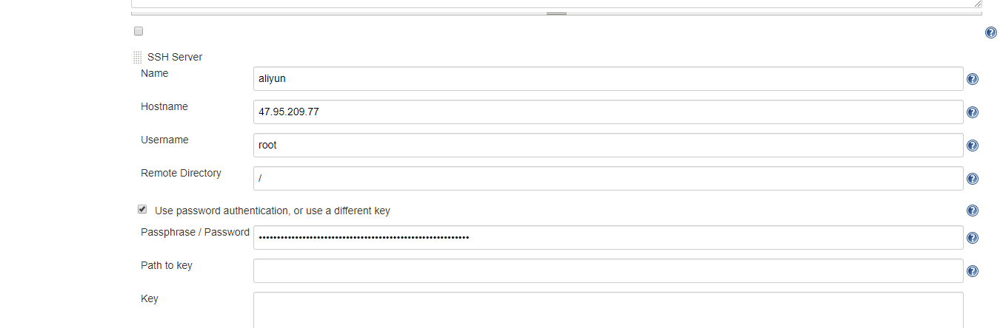
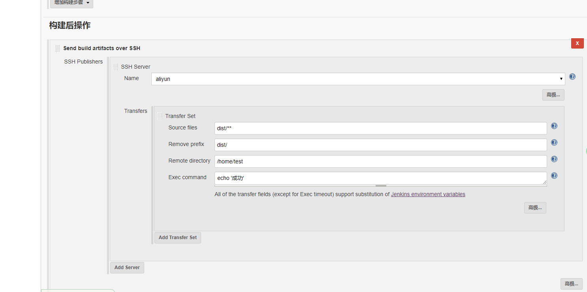

## 介绍

> Jenkins是一个开源的、可扩展的持续集成、交付、部署（软件/代码的编译、打包、部署）的基于web界面的平台。允许持续集成和持续交付项目，无论用的是什么平台，可以处理任何类型的构建或持续集成。


## 安装

### 1.docker方式运行

```yaml
version: '3'
services:
  jenkins:
    image: jenkinsci/blueocean
    # image: jenkins/jenkins:lts
    volumes:
        - ./jenkins-data:/var/jenkins_home
        - /var/run/docker.sock:/var/run/docker.sock
    ports:
        - "8029:8080"
    expose:
        - "8080"
        - "50000"
    privileged: true
    user: root
    restart: always
    container_name: jenkins
```


### 2. war包

```sh
java -jar jenkins.war
```


## 插件安装

### gitlab 相关插件

> gitlab plugin 安装完成后，在gitlab端可以触发Jenkins进行操作。

### node 相关插件

> 在打包环境中部署node (安装过程中会出现环境变量问题，提示node找不到，很可能是版本的原因，使用老版本即可；如node11)

### ssh 相关插件

> 链接远程主机，将指定文件复制到远程服务器中

#### 1. 使用密码登录




#### 2.使用密钥免密登录（travis-cl 中免密登录原理一样）

> 原理：利用 ssh-keygen 生产一对密钥文件，将私钥内容放到指定用户的authorized_keys文件中。在客户端中创建config文件。配置公钥位置等信息。然后通过ssh username@hostname登录


#### 3.复制文件



在要传输得文件夹后面写两个 **
如果只写一个* ，传输得只有build/classes下得文件，文件夹不会传输


## 总结

> gitlab中有文件推送时候，会触发jenkins。然后jenkins开始从gitlab拉取代码，然后执行指定的脚本。然后将编译后的代码通过ssh将代码推送到远端服务器中。


## 参考文章

[jenkins+gitlab 持续集成，自动构建](https://www.jianshu.com/p/90c3ff51aff7)

[jenkins中安装nodejs](https://www.jianshu.com/p/0a865a321d78)

[Jenkins publish over ssh传输文件夹](https://blog.csdn.net/suo082407128/article/details/90715278)

[ssh-keygen](https://www.jianshu.com/p/dd053c18e5ee)