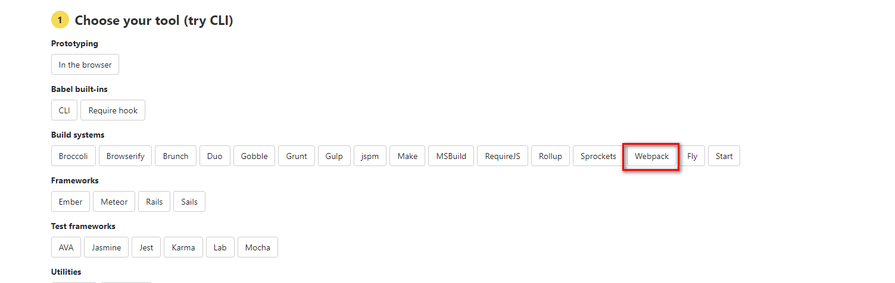

## loader 

> 处理常见的静态资源。

##  1.[处理js](https://www.babeljs.cn/setup#installation)
>js的编译则关系到另外一个生态，那就是babel；点击上面连接，即可



### 1. 安装
``` shell
cnpm install --save-dev babel-loader @babel/core
```

### 2.修改配置文件 
> 再webpack.config.js 文件中添加loader 配置规则。
```json 

module: {
  rules: [
    { test: /\.js$/, exclude: /node_modules/, loader: "babel-loader" }
  ]
}

```

### 3. 添加 .babelrc 配置文件

> 该文件用来管理babel。 babel也有自己的生态。编辑配置文件启用babel 的插件。

```json
// 它启用一个默认配置，解释用来减少配置的 
{
  "presets": ["@babel/preset-env"]
}
```

```shell
cnpm install @babel/preset-env --save-dev
```

### 4.浏览器兼容 

> 插件 @babel/preset-env ，会根据.browserslistrc结合配置中的useBuiltIns属性。使用@babel/polyfill对代码进行自动的兼容处理。

#### 1.创建 .browserslistrc

```shell
touch .browserslistrc

// 修改其配置 3句话的并集。使用份额大于百分之1，每个浏览器的最新的两个版本，ie大于等8
> 1%
last 2 versions
ie >= 8
```

#### 2.修改

```.babelrc

{
    "presets": [
        [
            "@babel/preset-env",
            // usage 会根据配置的浏览器兼容，以及你代码中用到的 API 来进行 polyfill，实现了按需添加。
            { "useBuiltIns": "usage" }
        ]
    ]
}
```

#### 3. 安装依赖

```shell
cnpm install @babel/polyfill -D

```


### 5. core-js@3

> 避免 promise 等不能使用

```shell
npm install --save core-js@3
```

### 6. babel插件 
>@babel/plugin-transform-runtime，可重新使用Babel注入的帮助程序代码以节省代码大小。

#### 1.代码压缩
```shell
cnpm install --save-dev @babel/plugin-transform-runtime
```
#### 2.动态引入文件
> @babel/plugin-syntax-dynamic-import,用以解析识别import()动态导入语法---并非转换，而是解析识别;

### 参考文章
1.[使用 Babel](https://www.babeljs.cn/setup#installation)

2.[一文带你了解babel-preset-env](https://www.jianshu.com/p/000c2670672b)

3.[babel-preset-env官方文档](https://www.babeljs.cn/docs/babel-preset-env)

4.[查询browserslistrc](https://browserl.ist/)

5.[@babel/plugin-syntax-dynamic-import](https://webpack.docschina.org/guides/code-splitting/#%E5%8A%A8%E6%80%81%E5%AF%BC%E5%85%A5-dynamic-imports-)
