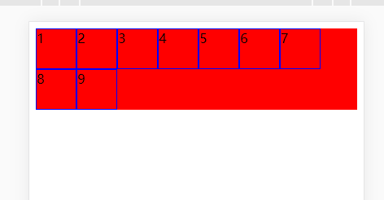
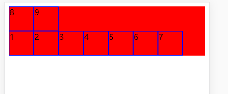

## flexbox

>主要分为父元素（flex容器）和子元素（flex项）


### 父元素

#### 1.定义伸缩容器
```css
.container {
  display: flex; /* or inline-flex */
//   父div设置该属性 inline-flex表示父元素是行内元素，宽度由子元素定义，flex：则表示父元素是块级元素，默认充满一行
}
```

#### 2.控制子元素水平方向的排列

```css
.container {
  flex-direction: row | row-reverse | column | column-reverse;
//   row：（默认值）横向（从左到右）；column：从上到下
}
```

#### 3.当一行元素超出一行时，控制子元素的垂直方向柔性包装

```css
.container{
  flex-wrap: nowrap | wrap | wrap-reverse;
}
```
nowrap:(默认)所有子元素都在一行上

wrap：从上到下，从左到右



wrap-reverse：从下到上，从左到右



#### 4.flex-flow:是flex-direction和flex-wrap组合的简写

```css
.container{
//   flex-flow:row nowrap;为默认值 
  flex-flow:row-reverse wrap;
}
```

#### 5.justify-content 用于设置或检索弹性盒子元素在主轴（横轴）方向上的对齐方式。

```css
justify-content: flex-start|flex-end|center|space-between|space-around|initial|inherit;
```

space-between:项目位于各行之间留有空白的容器内。(n个元素会有n-1个空隙)

space-around:项目位于各行之前、之间、之后都留有空白的容器内。(n个元素会有n+1个空隙)


#### 6.align-items 属性定义flex子项在flex容器的当前行的侧轴（纵轴）方向上的对齐方式。

```css
align-items: stretch|center|flex-start|flex-end|baseline|initial|inherit;
```

#### 7.align-content 单行的时候不生效，多行的时候效果和align-items效果类似，容器内必须有多行的项目，该属性才能渲染出效果。

>align-content 多行的情况下才会生效，且每行都有间距。[参考文档](https://developer.mozilla.org/zh-CN/docs/Web/CSS/align-content)

```css
.container {
  align-content: flex-start | flex-end | center | space-between | space-around | space-evenly | stretch | start | end | baseline | first baseline | last baseline + ... safe | unsafe;
}
```


### 子元素

#### 1.order:排列顺序
```css
.item {
  order: <integer>; /* default is 0 ，负数有效。*/
}
```

#### 2.flex-grow
>如果所有项目都flex-grow设置为1，则容器中的剩余空间将平均分配给所有子项。如果其中一个子元素的值为2，则剩余空间将占其他子元素的两倍（或者至少会尝试）。

```css
.item {
  flex-grow: <number>; /* default 0 ，负数无效。*/
}
```

#### 3.flex-shrink：定义了子元素必要时收缩的能力。flex-basis：父元素宽度足够时，子元素的大小

>加入超出所有子元素的宽度大于父元素，子元素会自动进行按照比例伸缩。加入所有元素的flex-shrink之和为6，当前元素的flex-shrink为1，需要收缩的子元素大小为100；则表示当前元素会比原来长度下(1/6)*100px

```css
.item {
  flex-basis:100px;
  flex-shrink: <number>; /* default 1 */
}
```

#### 4. flex-basis:剩余空间分配之前元素的默认大小 [参考文档](https://developer.mozilla.org/zh-CN/docs/Web/CSS/flex-basis)

> 应用场景
 - 1.bootstrap4 中的 col-sm-2 就是 flex: 0 0 16.666%，达到控制宽度控制
 - 2.bootstrap4 中的 col-sm-auto 就是 flex: 0 0 auto，达到可变宽度的弹性空间
```css
.item {
  flex-basis: <length> | auto; /* default auto */
}
```

#### 5.flex：属性用于设置或检索弹性盒模型对象的子元素如何分配空间。

>flex 属性是 flex-grow、flex-shrink 和 flex-basis 属性的简写属性。通常只用写第一个值，后面两个属性都是auto.

```css
flex: flex-grow flex-shrink flex-basis|auto|initial|inherit;
```


#### 6.align-self 属性定义flex子项单独在侧轴（纵轴）方向上的对齐方式。 [参考文档](https://developer.mozilla.org/zh-CN/docs/Web/CSS/align-items)

> 用于覆盖默认的对其方式。


#### 总结

父容器：只用记住display、flex-flow、justify-content、align-items、align-content。
子元素：只用记住order、flex、align-self。（重点：order和flex-grow:也就是flex的的第一个值,）


## 常用案例

### 1.完美居中

>flex容器中设置为 auto的外边距会吸收额外空间的事实

```css
<div class="parent">
    <div class="child">1</div>
</div>

.parent {
    display: flex;
    height: 300px;
    /* Or whatever */
    background-color: red;
}

.child {
    width: 100px;
    /* Or whatever */
    height: 100px;
    /* Or whatever */
    margin: auto;
    /* Magic! */
    border: 1px solid blue;
}
```

### 2.导航条

```css
 .navigation {
    list-style: none;
    margin: 0;
    background: deepskyblue;
    display: -webkit-box;
    display: -moz-box;
    display: -ms-flexbox;
    display: -webkit-flex;
    display: flex;
    -webkit-flex-flow: row wrap;
    justify-content: flex-end;
}

.navigation a {
    text-decoration: none;
    display: block;
    padding: 1em;
    color: white;
}

.navigation {
    list-style: none;
    margin: 0;
    background: deepskyblue;
    display: -webkit-box;
    display: -moz-box;
    display: -ms-flexbox;
    display: -webkit-flex;
    display: flex;
    -webkit-flex-flow: row wrap;
    justify-content: flex-end;
}

.navigation a:hover {
    background: darken(deepskyblue, 2%);
}

.navigation a {
    text-decoration: none;
    display: block;
    padding: 1em;
    color: white;
}

.navigation a:hover {
    background: darken(deepskyblue, 2%);
}

@media all and (max-width: 800px) {
    .navigation {
        justify-content: space-around;
    }
}

@media all and (max-width: 600px) {
    .navigation {
        -webkit-flex-flow: column wrap;
        flex-flow: column wrap;
        padding: 0;
    }
    .navigation a {
        text-align: center;
        padding: 10px;
        border-top: 1px solid rgba(255, 255, 255, 0.3);
        border-bottom: 1px solid rgba(0, 0, 0, 0.1);
    }
    .navigation li:last-of-type a {
        border-bottom: none;
    }
}
</style>

<ul class="navigation">
    <li><a href="#">Home</a></li>
    <li><a href="#">About</a></li>
    <li><a href="#">Products</a></li>
    <li><a href="#">Contact</a></li>
</ul>
```

### 3.管理后台的基本布局

```css
<style>
    .wrapper {
        display: flex;
        flex-flow: row wrap;
        font-weight: bold;
        text-align: center;
    }
    
    .wrapper>* {
        padding: 10px;
        flex: 1 100%;
    }
    
    .header {
        background: tomato;
    }
    
    .footer {
        background: lightgreen;
    }
    
    .main {
        text-align: left;
        background: deepskyblue;
    }
    
    .aside-1 {
        background: gold;
    }
    
    .aside-2 {
        background: hotpink;
    }
    
    @media all and (min-width: 600px) {
        .aside {
            flex: 1 0 0;
        }
    }
    
    @media all and (min-width: 800px) {
        .main {
            flex: 3 0px;
        }
        .aside-1 {
            order: 1;
        }
        .main {
            order: 2;
        }
        .aside-2 {
            order: 3;
        }
        .footer {
            order: 4;
        }
    }
</style>


<div class="wrapper">
    <header class="header">Header</header>
    <article class="main">
        <p>Pellentesque habitant morbi tristique senectus et netus et malesuada fames ac turpis egestas. Vestibulum tortor quam, feugiat vitae, ultricies eget, tempor sit amet, ante. Donec eu libero sit amet quam egestas semper. Aenean ultricies mi vitae
            est. Mauris placerat eleifend leo.</p>
    </article>
    <aside class="aside aside-1">Aside 1</aside>
    <aside class="aside aside-2">Aside 2</aside>
    <footer class="footer">Footer</footer>
</div>
```


## 参考文章
[ A Complete Guide to Flexbox | CSS-Tricks](https://css-tricks.com/snippets/css/a-guide-to-flexbox/#flexbox-background)
[详解CSS中flex布局-面向未来的网页设计理念](https://www.z01.com/help/web/3234.shtml)