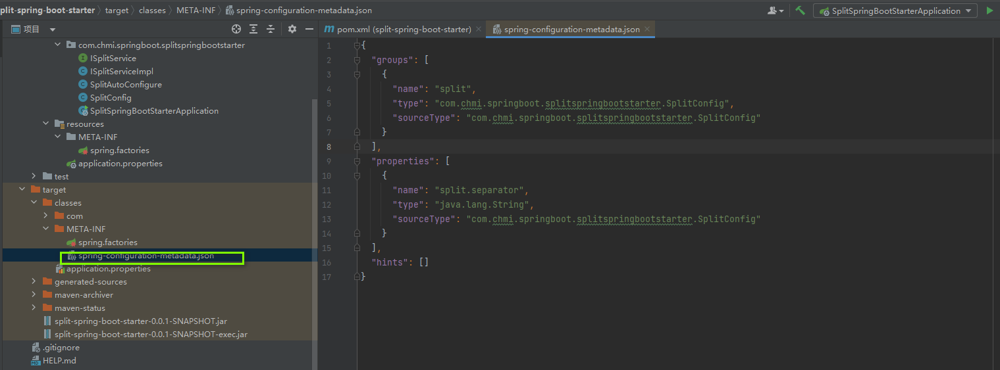

## 目标

> 实现一个springboot starter插件，实现自定义的功能


## springboot starter 机制

> starter让我们摆脱了各种依赖库的处理，需要配置各种信息的困扰。SpringBoot会自动通过classpath路径下的类发现需要的Bean，并注册进IOC容器。SpringBoot提供了针对日常企业应用研发各种场景的spring-boot-starter依赖模块。所有这些依赖模块都遵循着约定成俗的默认配置，并允许我们调整这些配置，即遵循“约定大于配置”的理念。


## 自定义starter的开发流程

1、命令规范，官方使用的是spring-boot-starter-xxx，xxx为自定义的starter名称；非官方使用的是xxx-spring-boot-starter，xxx为自定义的starter名称

2、添加依赖 spring-boot-configuration-processor
```xml
<dependency>
    <groupId>org.springframework.boot</groupId>
    <artifactId>spring-boot-configuration-processor</artifactId>
    <optional>true</optional>
</dependency>
```
> 该依赖用于生成META-INF/spring-configuration-metadata.json文件，该文件用于IDE的自动提示功能
<!-- 插入图片 -->


3、配置中如果使用了配置，创建配置类
```java
@Component
@ConfigurationProperties(prefix = "split")
public class SplitConfig {

    @Value(value = "${split.separator:,}")
    private String separator;

    public String getSeparator() {
        return separator;
    }

    public void setSeparator(String separator) {
        this.separator = separator;
    }
}
```

4、实现自定义功能
```java
public class ISplitServiceImpl implements ISplitService{
    private String separator;

    public ISplitServiceImpl(String separator) {
        this.separator = separator;
    }

    @Override
    public List<String> split(String value) {
        return Stream.of(StringUtils.split(value, separator)).collect(Collectors.toList());
    }
}
```

5、添加自动配置类
```java
@Configuration
@ConditionalOnClass(value = {ISplitService.class, ISplitServiceImpl.class})
public class SplitAutoConfigure {

    @Resource
    private SplitConfig splitConfig;

    @Bean
    @ConditionalOnMissingBean
    ISplitService startService(){
        return new ISplitServiceImpl(splitConfig.getSeparator());
    }
}
```
6、修改pom文件，修改打包的方式，否则其他项目依赖会找不到类
```xml
<plugin>
    <groupId>org.springframework.boot</groupId>
    <artifactId>spring-boot-maven-plugin</artifactId>
    <configuration>
        <classifier>exec</classifier>
    </configuration>
</plugin>
```

7、打包，发布到私服
```shell
 mvn clean install -Dmaven.test.skip=true
```


8、其他项目引入依赖
```xml
<dependency>
    <groupId>com.example</groupId>
    <artifactId>split-spring-boot-starter</artifactId>
    <version>1.0-SNAPSHOT</version>
</dependency>
```


## 参考文章

[项目地址](https://github.com/cmming/split-spring-boot-starter)