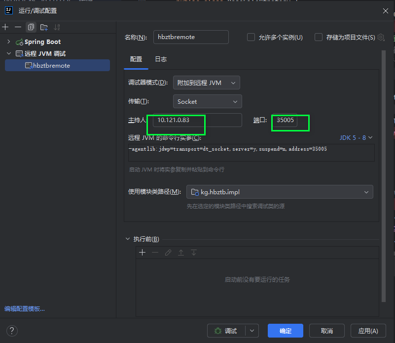

# 远程调试


## 1. 服务端配置

1. 在服务端的启动脚本中添加远程调试参数

```shell

# 最简配置方式
java -Xdebug -Xrunjdwp:transport=dt_socket,server=y,suspend=n,address=5005 -jar xxx.jar
# 目前配置
java -Xms10240m -Xmx20480m  -Xdebug -agentlib:jdwp=transport=dt_socket,address=0.0.0.0:5005,server=y,suspend=n -Djava.security.egd=file:/dev/./urandom -Dserver.tomcat.basedir=. -jar app.jar --spring.config.location=application.properties  --logging.config=logback-spring.xml -Dcom.sun.management.jmxremote -Dcom.sun.management.jmxremote.ssl=false -Dcom.sun.management.jmxremote.authenticate=false -Dcom.sun.management.jmxremote.port=8012 -Djava.rmi.server.hostname=0.0.0.0

```

## 2. 客户端配置

1. 在IDEA中添加远程调试配置




