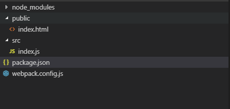

## 1.初始化 npm 项目

```shell
npm init
```

## 2.安装 

> 安装 webpack 以及脚手架和开发的服务器

```shell
cnpm i --save-dev webpack webpack-cli webpack-dev-server
```

## 3.创建配置文件

```shell
touch webpack.config.js
```

## 4.[编辑配置文件](https://webpack.docschina.org/configuration/dev-server/)

```js
const path = require('path')
 
module.exports = {
  entry: './src/index.js',
  devServer: {
    host: 'localhost',
    port: '8883',
    open: true,
    overlay: true,
  }
}
```

5. 修改package.json，添加命令

```json
// 会默认 寻找配置文件 webpack.config.js
// "dev": "webpack-dev-server --config webpack.config.js",
"dev": "webpack-dev-server",
```

6.[html-webpack-plugin](https://webpack.docschina.org/plugins/html-webpack-plugin/)

> 要看到网页效果就要依赖 插件 "html-webpack-plugin";

```js
cnpm i --save-dev html-webpack-plugin
```

```json 
plugins:[
    new HtmlWebpackPlugin({
        template: './public/index.html'
    })
]
```

7.总结 
> 此时文件结构如下，运行 npm run dev;既可以创建一个热加载的服务器。此时没有添加任何loader,也就不处理任何资源。



