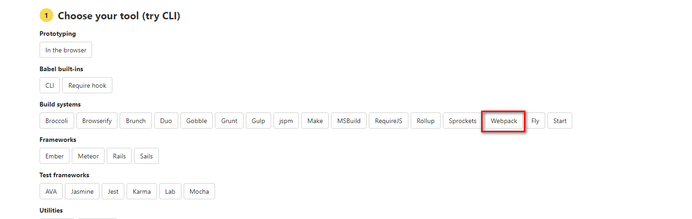
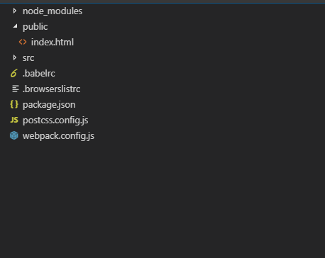

##  1.[处理js](https://www.babeljs.cn/setup#installation)
>js的编译则关系到另外一个生态，那就是babel；点击上面连接，即可



### 1. 安装
``` shell
cnpm install --save-dev babel-loader @babel/core
```

### 2.修改配置文件 
> 再webpack.config.js 文件中添加loader 配置规则。
```json 

module: {
  rules: [
    { test: /\.js$/, exclude: /node_modules/, loader: "babel-loader" }
  ]
}

```

### 3. 添加 .babelrc 配置文件

> 该文件用来管理babel。 babel也有自己的生态。编辑配置文件启用babel 的插件。

```json
// 它启用一个默认配置，解释用来减少配置的 
{
  "presets": ["@babel/preset-env"]
}
```

```shell
cnpm install @babel/preset-env --save-dev
```

### 4.浏览器兼容 

> 插件 @babel/preset-env ，会根据.browserslistrc结合配置中的useBuiltIns属性。使用@babel/polyfill对代码进行自动的兼容处理。

#### 1.创建 .browserslistrc

```shell
touch .browserslistrc

// 修改其配置 3句话的并集。使用份额大于百分之1，每个浏览器的最新的两个版本，ie大于等8
> 1%
last 2 versions
ie >= 8
```

#### 2.修改

```.babelrc

{
    "presets": [
        [
            "@babel/preset-env",
            // usage 会根据配置的浏览器兼容，以及你代码中用到的 API 来进行 polyfill，实现了按需添加。
            { "useBuiltIns": "usage" }
        ]
    ]
}
```

#### 3. 安装依赖

```shell
cnpm install @babel/polyfill -D

```


### 5. core-js@3

> 避免 promise 等不能使用

```shell
npm install --save core-js@3
```

### 6. babel插件 
>@babel/plugin-transform-runtime，可重新使用Babel注入的帮助程序代码以节省代码大小。

#### 1.代码压缩
```shell
cnpm install --save-dev @babel/plugin-transform-runtime
```
#### 2.动态引入文件
> @babel/plugin-syntax-dynamic-import,用以解析识别import()动态导入语法---并非转换，而是解析识别;

### 参考文章
1.[使用 Babel](https://www.babeljs.cn/setup#installation)

2.[一文带你了解babel-preset-env](https://www.jianshu.com/p/000c2670672b)

3.[babel-preset-env官方文档](https://www.babeljs.cn/docs/babel-preset-env)

4.[查询browserslistrc](https://browserl.ist/)

5.[@babel/plugin-syntax-dynamic-import](https://webpack.docschina.org/guides/code-splitting/#%E5%8A%A8%E6%80%81%E5%AF%BC%E5%85%A5-dynamic-imports-)


## 2.[处理图片和字体文件](https://webpack.docschina.org/loaders/url-loader/)

>它将文件转换为base64 URI。

```shell
cnpm install url-loader --save-dev
```

```js
{
    test: /\.(png|jpe?g|gif|svg)(\?.*)?$/,
    use: [
        {
            loader: 'url-loader',
            options: {
                //图片 小于 10240B 
                limit: 10240,
                name: '[name]_[hash].[ext]',
                outputPath: "images/"
            }
        }
    ]
}
```
### 注意

>webpack中file-loader和url-loader的关系,url-loader把资源文件转换为URL，file-loader也是一样的功能.不同之处在于url-loader更加灵活，它可以把小文件转换为base64格式的URL，从而减少网络请求次数。url-loader依赖file-loader。在大多数情况下，使用url-loader准没错。


## 3.[处理样式](https://webpack.docschina.org/loaders/url-loader/)

```shell
cnpm install --save-dev style-loader css-loader sass-loader postcss-loader
```

    1.style-loader:解析style里面的样式
    2.css-loader：解析 import进来的css
    3.sass-loader：解析 sass
    4.postcss-loader：为样式自动处理功能，例如Autoprefixer ，此时可以生成 postcss.config.js文件作为其的独立配置文件

```js
//scss 多个 loader同时工作的时候，从下往上指定
{
    test: /\.css|\.scss$/,  // 正则匹配所有.css后缀的样式文件
    use: ['style-loader',
        {
            loader: 'css-loader',
            options: {
                importLoaders: 2,// 让所有的 scss 都会重新使用 sass-loader postcss-loader 进行处理
                modules: true //样式模块化 避免全局污染
            }
        },
        "sass-loader",
        "postcss-loader"] // 使用这两个loader来加载样式文件
},
//css
{
    test: /\.css$/,  // 正则匹配所有.css后缀的样式文件
    use: ['style-loader',
        "css-loader",
        "postcss-loader"] // 使用这两个loader来加载样式文件
}
```

## 总结

> 最终的配置文件如下
```js
const path = require('path')
const HtmlWebpackPlugin = require('html-webpack-plugin')

module.exports = {
    entry: './src/index.js',
    devServer: {
        host: 'localhost',
        port: '8883',
        open: true,
        overlay: true,
    },
    module: {
        rules: [{
                test: /\.(png|jpe?g|gif|eot|woff2?|ttf|svg)(\?.*)?$/,
                use: [{
                    loader: 'url-loader',
                    options: {
                        //图片 小于 10240B 
                        limit: 10240,
                        name: '[name]_[hash].[ext]',
                        outputPath: "images/"
                    }
                }]
            },
            {
                test: /\.css|\.scss$/, // 正则匹配所有.css后缀的样式文件
                use: ['style-loader',
                        {
                            loader: 'css-loader',
                            options: {
                                importLoaders: 2, // 让所有的 scss 都会重新使用 sass-loader postcss-loader 进行处理
                                modules: true //样式模块化 避免全局污染
                            }
                        },
                        "sass-loader",
                        "postcss-loader"
                    ] // 使用这两个loader来加载样式文件
            },
            //css
            {
                test: /\.css$/, // 正则匹配所有.css后缀的样式文件
                use: ['style-loader',
                        "css-loader",
                        "postcss-loader"
                    ] // 使用这两个loader来加载样式文件
            },
            { test: /\.js$/, exclude: /node_modules/, loader: "babel-loader" }
        ]
    },
    plugins: [
        new HtmlWebpackPlugin({
            template: './public/index.html'
        })
    ]
}
```
> 文件结构



